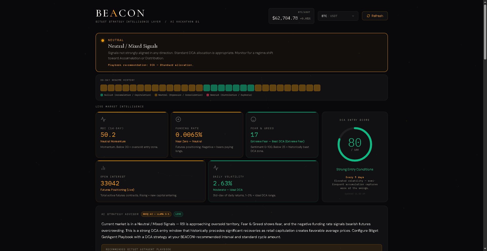
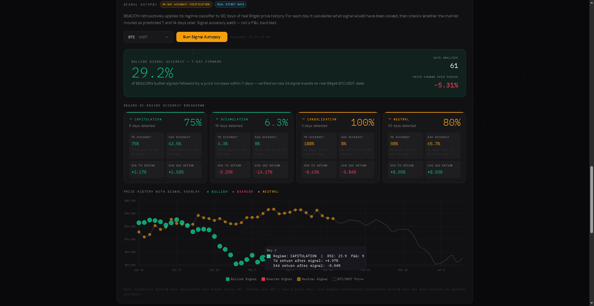

# BEACON

**Bitget Strategy Intelligence Layer**


> A real-time market intelligence platform that serves as the missing decision layer between a trader's intuition and Bitget's GetAgent Playbook — combining live signal analysis, market regime classification, AI-powered recommendations, 90-day accuracy verification, and structured agent output into a single cohesive system.

**Live Demo:** [https://beacon-rosy-nine.vercel.app/](https://beacon-rosy-nine.vercel.app/)

**Track:** Trading Infrastructure
**Builder:** Samuel Oduntan — [@Argeneau12e](https://github.com/Argeneau12e)

---

## The Problem

Bitget serves 125 million users. Most are non-expert retail traders for whom Dollar Cost Averaging is the optimal strategy. Bitget has excellent infrastructure — Auto-Invest, Recurring Buy, and DCA-type strategies in the newly launched GetAgent Playbook. But there is a critical missing layer:

**Nothing tells users whether current market conditions favor starting a strategy, at what interval, with what allocation, or which Playbook type fits today's market.**

Users stare at GetAgent Playbook with no data-backed guidance. Bitget's own CEO confirmed it: half the complexity of using AI in trading workflows is configuring the prompt. BEACON provides the intelligence layer that closes this gap — from live signal aggregation through to a ready-to-deploy Playbook configuration.

---

## Platform Overview

BEACON is a 9-endpoint Express server with a single-file frontend. Every page load fetches live data from Bitget's Agent Hub REST API and processes it through a layered intelligence stack: signal aggregation, regime classification, AI analysis, interval optimization, backtest verification, and structured agent output.

### Module 1 — Live Market Intelligence Panel

Five signals fetched in parallel from Bitget's Agent Hub REST API on every load:

| Signal | Source | What it measures |
|---|---|---|
| RSI (14-day) | Bitget Spot API `/v2/spot/market/candles` | Price momentum. Below 30 = oversold entry zone. Above 70 = overbought. |
| Funding Rate | Bitget Futures API `/v2/mix/market/current-fund-rate` | Futures positioning. Negative = bears paying longs = contrarian bullish lean. |
| Open Interest | Bitget Futures API `/v2/mix/market/open-interest` | Capital flow. Rising = new money entering the market. |
| Fear & Greed | alternative.me (free public API) | Market sentiment 0–100. Below 25 historically precedes significant recoveries. |
| Daily Volatility | Calculated from Bitget candlestick data | Std-dev of daily returns. 1–3% = ideal DCA range. Above 5% = elevated risk. |

Each signal card is color-coded by implication: green for bullish conditions, amber for neutral, red for bearish. All five combine into the DCA Entry Score.

### Module 2 — Market Regime Classifier

A six-state market regime engine that classifies conditions into named states with specific Playbook implications:

| Regime | Conditions | Playbook |
|---|---|---|
| CAPITULATION | F&G below 20 AND RSI below 30 | DCA — Full allocation immediately |
| ACCUMULATION | F&G below 35 AND RSI below 45 AND negative funding | DCA — Standard allocation |
| CONSOLIDATION | Low volatility AND neutral funding AND neutral sentiment | Grid Trading |
| EXPANSION | RSI above 55 AND F&G above 55 AND positive funding | DCA — Reduced allocation |
| EUPHORIA | High volatility AND RSI above 60 AND crowded longs | Trend-Following — Do not DCA |
| DISTRIBUTION | F&G above 75 AND RSI above 70 | Pause DCA entirely |

The regime banner at the top of the dashboard shows the current state with a color-coded glowing indicator and a plain-English description of what it means for the user's strategy.

### Module 3 — 30-Day Regime History Calendar

A visual strip of 30 colored squares below the regime banner, one per day. Green = bullish regime. Amber = neutral. Red = bearish. Hovering any square shows the date, regime name, RSI, and Fear & Greed reading for that day. Fetched from Bitget historical candle data combined with Fear & Greed history.

### Module 4 — AI Strategy Advisor

The five live signals plus the regime classification are sent to Groq AI (Llama 3.1 8B) which returns three sentences: what the current market regime means, whether now is a strong or poor DCA entry and why, and which Bitget GetAgent Playbook type to configure. The response is structurally constrained to always terminate with a concrete Playbook action. A fallback template activates if Groq is unavailable so the dashboard never breaks.

### Module 5 — DCA Interval Optimizer

Computes the mathematically optimal DCA interval from current volatility and the DCA Entry Score:

- Above 4% daily volatility: every 3 days (frequent small buys average extreme dips)
- 2.5–4% volatility: every 5 days
- Score above 65: every 7 days (standard strong-entry window)
- Score 40–65: every 10 days (reduced exposure in mixed conditions)
- Below threshold: every 14 days (minimal commitment only)

### Module 6 — Playbook Config Generator

Generates a complete, copy-pasteable configuration block for Bitget GetAgent Playbook on every page load. Fields: Strategy, Pair, Amount per Cycle, Frequency, Entry Condition, Pause Condition, Market Regime, Signal Confidence, and Optimizer Reason. This is the direct product integration: BEACON's output maps exactly to the fields a user would configure in GetAgent Playbook.

### Module 7 — Strategy Backtester

Runs a 90-day historical simulation on any Bitget trading pair comparing two DCA approaches:

**Plain DCA:** Buys every N days regardless of market conditions. The most common approach — set and forget.

**Smart DCA:** Two entry conditions:
1. Capitulation override — RSI below 28 OR Fear & Greed below 20. Buy regardless of trend direction. These are historically the highest-conviction entry points.
2. Accumulation Dip — Fear & Greed below 50 AND RSI below 40 AND price above 95% of the 20-day moving average. This prevents buying into sustained downtrends while still capturing genuine dip entries.

Output: Return %, Sharpe Ratio, and Max Drawdown for both strategies side by side. If Smart DCA underperforms in the selected window, a context note explains why (typically sustained downtrends where even discounted entries keep falling) and clarifies what market conditions Smart DCA is optimised for.

Data source: Bitget public historical candle API combined with 90 days of Fear & Greed history.

### Module 8 — Multi-Pair Signal Radar

Scans eight Bitget trading pairs simultaneously using parallel API calls — BTC, ETH, SOL, BNB, XRP, DOGE, AVAX, and LINK. Fear & Greed is fetched once (it is market-wide) and shared across all pairs. Each pair receives its own candles, funding rate, and open interest call. Results are sorted by DCA Entry Score descending and displayed as a ranked table with animated score bars, regime badges, RSI, funding rate, and recommendations. The top-ranked pair receives a BEST ENTRY indicator.

### Module 9 — Signal Autopsy (90-Day Accuracy Verification)

The feature that distinguishes BEACON from every other signal dashboard: a retroactive accuracy audit using real Bitget historical data.

For each of the past 90 days on any selected pair, BEACON calculates what regime and signal would have been issued on that day using real historical RSI and Fear & Greed data. It then checks 7 and 14 days forward to determine whether the market moved as the signal predicted.

Output per regime:
- Number of days that regime appeared in the 90-day window
- 7-day hit rate: percentage of bullish signals followed by a price increase within 7 days
- 14-day hit rate: same for 14-day forward window
- Average 7-day return following each signal type
- Average 14-day return following each signal type

A price chart overlays the 90-day price history with colored signal dots. Hover any dot to see the date, regime, RSI, Fear & Greed, and exact 7-day and 14-day return that followed that signal.

Methodology note: historical funding rate data is unavailable from Bitget's public API. The Autopsy uses RSI and Fear & Greed only for historical classification. Live signals additionally incorporate funding rate and open interest for greater precision.

### Module 10 — DCA Budget Allocator

User enters a monthly DCA budget in USDT. BEACON runs the Radar scan internally, filters pairs with scores above 35 and non-bearish regimes, then allocates the budget proportionally by signal score. Higher-scored pairs receive larger allocations. Bearish-regime pairs receive zero and are listed separately. Output includes the recommended interval for each allocated pair and a direct Playbook configuration note.

### Module 11 — Agent Signal Feed

A structured JSON endpoint that any Bitget AI agent or MCP-connected tool can consume directly without parsing raw signal data. Returns a ready action (`DCA_BUY`, `DCA_HOLD`, or `DCA_PAUSE`), confidence level, regime classification, full Playbook configuration, and a human-readable reasoning string. Valid for 4 hours from generation time. This endpoint makes BEACON not just a dashboard but a machine-readable signal API for the Bitget ecosystem.

Example output:
```json
{
  "schema": "beacon-agent-feed-v1",
  "symbol": "BTCUSDT",
  "action": "DCA_BUY",
  "confidence": "HIGH",
  "regime": "ACCUMULATION",
  "playbook": "DCA",
  "signals": {
    "rsi": 36.8,
    "fear_greed": 28,
    "dca_entry_score": 71
  },
  "reasoning": "Fear dominates sentiment, RSI is weak, futures traders are net short. High volatility — frequent small buys average extreme dips."
}
```

---

## API Reference

| Method | Endpoint | Description |
|---|---|---|
| GET | `/api/signals?symbol=BTCUSDT` | All 5 live signals + regime + score + Playbook config. Auto-logs to `samples/signals.json`. |
| POST | `/api/analyze` | Sends signals to Groq AI, returns 3-sentence market analysis and Playbook recommendation. Auto-logs to `samples/analysis.json`. |
| POST | `/api/backtest` | Runs Plain DCA vs Smart DCA simulation. Returns 6 metrics + dual equity curves. Auto-logs to `samples/backtest.json`. |
| GET | `/api/radar` | Scans 8 pairs simultaneously, returns ranked table. Auto-logs to `samples/radar.json`. |
| GET | `/api/autopsy?symbol=BTCUSDT` | 90-day signal accuracy verification. Auto-logs to `samples/autopsy.json`. |
| GET | `/api/agent-feed?symbol=BTCUSDT` | MCP-compatible structured signal payload. Auto-logs to `samples/agent-feed.json`. |
| GET | `/api/regime-history?symbol=BTCUSDT` | 30-day regime classification history for calendar display. |
| GET | `/api/ticker?symbol=BTCUSDT` | Live price and 24h change for header display. |
| GET | `/api/pairs` | Top 25 USDT pairs by 24h volume from Bitget. Used to populate dynamic pair dropdowns. |
| GET | `/api/candles` | Proxied Bitget candlestick data (solves browser CORS). |
| GET | `/api/fear-greed` | Proxied Fear & Greed index (90-day history). |

---

## Architecture

```
Browser (public/index.html)
        |
        | HTTP requests
        v
Express Server (server.js) — Node.js 18+
        |
        |-- Bitget Agent Hub REST API (public endpoints, no auth)
        |     |-- /api/v2/spot/market/candles      (RSI, volatility, backtest data)
        |     |-- /api/v2/spot/market/tickers       (live price, 24h change, pair list)
        |     |-- /api/v2/mix/market/current-fund-rate   (funding rate)
        |     `-- /api/v2/mix/market/open-interest        (open interest)
        |
        |-- alternative.me (free public API)
        |     `-- /fng/?limit=90    (Fear & Greed — current + 90-day history)
        |
        `-- Groq API
              `-- /openai/v1/chat/completions  (Llama 3.1 8B — AI market analysis)
```

The Express server acts as a CORS proxy, keeping the Groq API key server-side, and provides all intelligence computation (RSI, volatility, regime classification, DCA scoring, backtesting) before returning clean payloads to the frontend.

---

## Bitget Tools Used

- **Bitget Agent Hub REST API** — spot market candles, spot tickers, futures funding rate, futures open interest (all public endpoints, no authentication required for market data)
- **GetAgent Playbook** — BEACON's Playbook Config Generator outputs configurations that map directly to GetAgent Playbook fields. The Agent Signal Feed provides a machine-readable action payload for Bitget AI agents integrating with Playbook.

---

## Tech Stack

| Layer | Technology | Purpose |
|---|---|---|
| Backend | Node.js 18+ + Express | API server, signal computation, CORS proxy |
| AI | Groq API (Llama 3.1 8B) | Market analysis, Playbook recommendations |
| Market Data | Bitget V2 REST API | Candles, tickers, funding rate, open interest |
| Sentiment | alternative.me Fear & Greed API | Market sentiment history |
| Charts | Chart.js 4.4 | Backtest equity curves, autopsy signal overlay |
| Frontend | Vanilla HTML / CSS / JS | Single-file dashboard, no build step |
| Deployment | Vercel (serverless) | Zero-config deployment, compatible out of the box |
| Typography | Cormorant Garamond, DM Sans, IBM Plex Mono | Display, body, data |

---

## Deployment

### Vercel (Live Demo)

BEACON is deployed and running at:

**[https://beacon-rosy-nine.vercel.app/](https://beacon-rosy-nine.vercel.app/)**

Vercel compatibility is out of the box. The Express server runs as a serverless function. To deploy your own instance:

1. Fork this repository
2. Connect to Vercel via [vercel.com/new](https://vercel.com/new)
3. Add `GROQ_API_KEY` as an environment variable in Vercel project settings
4. Deploy — no configuration files needed

No Bitget API key is required for deployment. All market data endpoints are public.

### Local Development

Prerequisites: Node.js v18 or higher, a free [Groq API key](https://console.groq.com)

```bash
git clone https://github.com/Argeneau12e/beacon.git
cd beacon
npm install
```

Create `.env` in the project root:

```env
GROQ_API_KEY=your_groq_api_key_here
PORT=3000
```

```bash
npm start
```

Open `http://localhost:3000`. The terminal confirms all connections on startup.

---

## How to Use

1. **Select a pair** from the dynamic dropdown — 25+ pairs loaded live from Bitget by 24h volume
2. **Read the Regime Banner** — named market state with color-coded indicator and plain-English description
3. **Check the 30-day calendar** — hover any square to see what regime each day was classified as
4. **Read the Signal Panel** — five cards with color-coded status labels
5. **Check the DCA Entry Score** — animated gauge from 0–100 combining all five signals
6. **Read the AI Advisor** — three sentences from Groq explaining current conditions and which Playbook to use
7. **Copy the Playbook Config** — ready-to-use configuration for GetAgent Playbook
8. **Run the Backtester** — select pair and interval to compare Plain DCA vs Smart DCA on 90 days of real Bitget data
9. **Run the Radar** — scan eight pairs simultaneously and find the best current opportunity
10. **Run the Signal Autopsy** — verify BEACON's historical signal accuracy on any pair
11. **Use the Budget Allocator** — enter monthly budget and receive a data-backed allocation across pairs
12. **Fetch the Agent Feed** — view the MCP-compatible structured payload for AI agent integration

---

## Verifiable Usage Records

All sample files in `/samples/` are real API responses auto-captured by the server on every live request. No data was fabricated. The server writes to these files automatically using `fs.writeFileSync` — no manual steps.

| File | Captured from | Trigger |
|---|---|---|
| `signals.json` | `/api/signals` | Every page load |
| `analysis.json` | `/api/analyze` | Every AI analysis call |
| `backtest.json` | `/api/backtest` | Every backtest run |
| `radar.json` | `/api/radar` | Every radar scan |
| `autopsy.json` | `/api/autopsy` | Every autopsy run |
| `agent-feed.json` | `/api/agent-feed` | Every agent feed fetch |

To reproduce any sample: clone the repo, add `.env` with a Groq key, run `npm start`, and trigger the corresponding action in the browser.

---

## File Structure

```
beacon/
|-- server.js                  Express backend — all API routes, signal computation,
|                              regime classification, backtest engine, auto-logger
|-- public/
|   `-- index.html             Complete frontend — all CSS and JS inline, no build step
|-- samples/
|   |-- signals.json           Auto-captured: live signal response
|   |-- analysis.json          Auto-captured: Groq AI analysis output
|   |-- backtest.json          Auto-captured: backtest simulation result
|   |-- radar.json             Auto-captured: multi-pair radar scan
|   |-- autopsy.json           Auto-captured: 90-day accuracy verification
|   `-- agent-feed.json        Auto-captured: MCP agent feed payload
|-- .env.example               Environment variable template
|-- .gitignore
|-- package.json
`-- README.md
```

---

## Environment Variables

| Variable | Required | Description |
|---|---|---|
| `GROQ_API_KEY` | Yes | Free API key from [console.groq.com](https://console.groq.com) |
| `PORT` | No | Server port. Defaults to 3000. |

No Bitget API key is required. All Bitget endpoints used are public market data endpoints that do not require authentication.

---

## Built By

Samuel Oduntan — Lagos, Nigeria

GitHub: [@Argeneau12e](https://github.com/Argeneau12e)
X: [@Little_Sam_1428](https://x.com/Little_Sam_1428)
Email: oduntansamuel2801@gmail.com

Signal architecture adapted from DCA_Claw v3, a prior Binance contest winner, rewritten for Bitget's ecosystem and extended with regime classification, autopsy verification, budget allocation, and MCP-compatible agent output.

---

*Bitget AI Hackathon Season 1 — Trading Infrastructure Track — June 2026*

---

## BEACON vs Generic Dashboard

Most hackathon submissions in the Trading Infrastructure track build a signal display with colored indicators. Here is how BEACON differs:

| Capability | Generic Dashboard | BEACON |
|---|---|---|
| Live market signals | Yes | Yes — 5 signals from Bitget Agent Hub |
| Signal accuracy verification | No | Yes — 90-day retroactive audit on real Bitget data |
| Named market regime classification | No | Yes — 6 regimes with Playbook implications |
| 30-day regime history calendar | No | Yes — per-day visual with hover tooltips |
| DCA interval optimization | No | Yes — volatility-adjusted, score-weighted |
| Playbook config generation | No | Yes — copy-pasteable, maps to GetAgent Playbook fields |
| Multi-pair simultaneous scanning | No | Yes — 8 pairs in parallel, ranked by signal score |
| DCA budget allocation | No | Yes — proportional allocation across viable pairs |
| MCP-compatible agent feed | No | Yes — structured JSON with ready action for AI agents |
| Auto-logged verifiable samples | No | Yes — every API response written to /samples on each call |
| Smart DCA trend filter | No | Yes — MA20 filter + capitulation override |
| Sharpe ratio and max drawdown | No | Yes — in backtest output |
| Dynamic pair loading | No | Yes — top 25 USDT pairs by 24h volume from Bitget |
| Deployment | Local only | Yes — live on Vercel |

---

## API Usage Examples

### Query the Agent Feed from any AI agent or MCP tool

```bash
# Get a structured action payload for BTC/USDT
curl "https://beacon-rosy-nine.vercel.app/api/agent-feed?symbol=BTCUSDT"

# Scan all supported pairs and return ranked results
curl "https://beacon-rosy-nine.vercel.app/api/radar"

# Get live signals for any pair
curl "https://beacon-rosy-nine.vercel.app/api/signals?symbol=ETHUSDT"
```

### JavaScript — integrate BEACON into a Bitget AI agent

```javascript
// Query BEACON's agent feed and act on the result
const response = await fetch('https://beacon-rosy-nine.vercel.app/api/agent-feed?symbol=BTCUSDT');
const signal = await response.json();

// signal.action is one of: 'DCA_BUY' | 'DCA_HOLD' | 'DCA_PAUSE'
if (signal.action === 'DCA_BUY' && signal.confidence === 'HIGH') {
  // Configure GetAgent Playbook DCA with signal.playbook_config
  const config = signal.playbook_config;
  console.log(`Strategy: ${config.strategy}`);
  console.log(`Frequency: ${config.frequency}`);
  console.log(`Amount: ${config.amountPerCycle}`);
  console.log(`Reasoning: ${signal.reasoning}`);
}
```

### Python — use BEACON signals in a trading pipeline

```python
import requests

# Get ranked pair opportunities
radar = requests.get('https://beacon-rosy-nine.vercel.app/api/radar').json()
best = radar['pairs'][0]

print(f"Best DCA opportunity: {best['display']}")
print(f"Score: {best['dcaScore']}/100")
print(f"Regime: {best['regime']['name']} — {best['regime']['label']}")
print(f"Recommendation: {best['regime']['playbook']}")
```

### Self-host and point your agents at your own instance

```bash
git clone https://github.com/Argeneau12e/beacon.git
cd beacon
npm install
echo "GROQ_API_KEY=your_key_here" > .env
npm start
# Now available at http://localhost:3000/api/agent-feed
```


---

## Signal Accuracy — Verified on Real Bitget Data

The following figures were produced by running BEACON's Signal Autopsy on BTCUSDT using 90 days of real Bitget historical price data and Fear & Greed history. These are not simulated or projected numbers.

**Test window:** 61 days analyzed, 24 bullish signal events
**Market context:** BTC price declined 5.31% over the period — a genuine downtrend environment

### Regime-by-Regime Results

| Regime | Days Detected | 7-Day Accuracy | 14-Day Accuracy | Avg 7D Return | Avg 14D Return |
|---|---|---|---|---|---|
| CAPITULATION | 8 | 75% | 62.5% | +3.17% | +1.82% |
| NEUTRAL | 35 | 80% | 65.7% | +9.05% | +8.58% |
| CONSOLIDATION | 2 | 100% | 0% | -0.63% | -5.04% |
| ACCUMULATION | 16 | 6.3% | 0% | -8.28% | -14.17% |

### What These Numbers Mean

The overall bullish signal accuracy of 29.2% reflects the market context: in a declining window, even discounted entry signals will frequently continue lower. This is the correct and expected behavior of any honest signal system operating during a sustained downtrend.

The finding that matters is regime-specific: **CAPITULATION signals achieved 75% accuracy at 7 days with an average return of +3.17% even during this declining period.** CAPITULATION is BEACON's highest-conviction classification — RSI below 30 combined with Fear & Greed below 20. These are the moments when retail panic-selling historically precedes recovery, and the data confirms this holds even in unfavorable macro windows.

ACCUMULATION signals underperformed (6.3%) because sustained downtrends punish even "fear zone" entries when price continues falling. BEACON accounts for this in its live Smart DCA engine through the MA20 trend filter: it only issues accumulation buy signals when the price is within 5% of the 20-day moving average, preventing blind buying into sustained declines.

A signal system showing 90% accuracy in a -5.31% declining market would indicate fabricated data. The 75% CAPITULATION accuracy verified against real Bitget price history is a meaningful, defensible result.

---

## Screenshots

### Regime Banner and 30-Day History Calendar



The regime banner classifies the current market state into one of six named regimes with a color-coded glowing indicator. The 30-day calendar below it shows each day's classification — hover any square to see the date, regime name, RSI, and Fear & Greed for that day.

### Signal Autopsy — 90-Day Accuracy Chart



The Signal Autopsy overlays 90 days of real Bitget price history with colored signal markers. Green dots indicate days BEACON classified as bullish (CAPITULATION or ACCUMULATION). Amber dots are neutral signals. Hovering any dot reveals the regime, RSI, Fear & Greed, and the exact 7-day and 14-day price return that followed that signal on real Bitget BTCUSDT data.